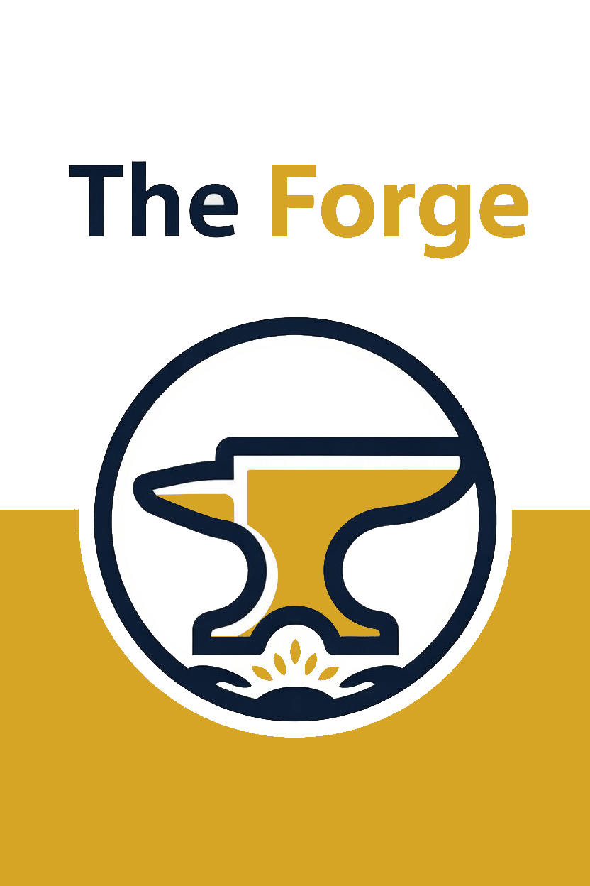

<p align="left">
  
</p>

# The Forge Marketplace

A curated collection of Claude Code plugins for reasoning, product management, productivity, and unified dashboard orchestration.

The Forge Marketplace is a plugin catalog for [Claude Code](https://docs.anthropic.com/en/docs/claude-code) and [Claude Cowork](https://claude.com/blog/cowork-plugins).

## Plugins

### Cognitive Forge v1.2.0

Deep concept evaluation through multi-agent debate and interactive guided exploration. Spawns specialized agents (Challenger, Explorer, Synthesizer) for parallel analysis or leads iterative dialogue with selective agent recruitment.

**Commands:**
- `/cognitive-forge:debate` — Multi-agent parallel concept evaluation with cross-examination and synthesis
- `/cognitive-forge:explore` — Interactive guided exploration with iterative dialogue and agent recruitment

Sessions are automatically persisted to `sessions/debates/` and `sessions/explorations/` and viewable in the built-in dashboard.

### Product Forge Local v1.0.5

Local-first product management for structured card generation. Automates Initiative, Epic, and Story card creation following the Jira hierarchy, with all outputs stored as local markdown files with YAML frontmatter.

**Commands:**
- `/product-forge-local:intake` — Structured interview for gathering product requirements
- `/product-forge-local:initiative` — Generate, update, or review Initiative cards
- `/product-forge-local:epic` — Generate, update, or review Epic cards
- `/product-forge-local:story` — Generate, update, or review Story cards
- `/product-forge-local:release-notes` — Generate product release notes
- `/product-forge-local:checkpoint` — Capture a knowledge checkpoint
- `/product-forge-local:decision` — Log a decision to the Decision Log

### Productivity v1.1.0

Task management, daily planning, and organizational memory. Syncs with your calendar, email, and chat to keep everything organized and on track.

**Commands:**
- `/productivity:plan-day` — Plan your day with calendar and task integration
- `/productivity:task` — Create, update, and manage tasks
- `/productivity:remember` — Store important context in organizational memory
- `/productivity:setup-org` — Configure organizational taxonomy (products, modules, clients, teams)

### Rovo Agent Forge v1.0.0

Interactive builders for Atlassian Rovo agents. Guides through Jira and Confluence agent configuration via adaptive interview and outputs copy-ready sections for Rovo Studio. Agent configurations are saved to `rovo-agents/` in your project root and can be visualized and edited in the Forge Shell dashboard.

**Commands:**
- `/rovo-agent-forge:jira-agent` — Build a Jira-focused Rovo agent configuration
- `/rovo-agent-forge:confluence-agent` — Build a Confluence-focused Rovo agent configuration

### Forge Shell v1.0.0

Unified dashboard shell that provides a single-page application for switching between plugin views. Acts as the single entry point for all visual plugin interfaces.

**Commands:**
- `/forge-shell:add` — Register a plugin dashboard in the shell
- `/forge-shell:open` — Open the unified shell

## How They Work Together

The five plugins form an integrated workflow:

1. **Productivity** provides the organizational memory layer (products, modules, clients, teams) that Product Forge Local uses for taxonomy validation.
2. **Cognitive Forge** offers deep reasoning tools for evaluating product concepts, architectural decisions, or strategic directions before they become cards.
3. **Product Forge Local** turns approved concepts into structured work items (Initiatives, Epics, Stories) with full hierarchy tracking.
4. **Rovo Agent Forge** builds Atlassian Rovo agent configurations through guided interviews, saving them to `rovo-agents/` in your project root.
5. **Forge Shell** unifies all plugin views into a single-page application for browsing sessions, cards, tasks, and agent configs without leaving the browser.

Plugins write to dedicated directories in your project root: `cards/` (Product Forge Local), `sessions/` (Cognitive Forge), and `rovo-agents/` (Rovo Agent Forge).

## Installation

Add the marketplace to your project's `.claude/settings.json`:

```json
{
  "extraKnownMarketplaces": {
    "the-forge-marketplace": {
      "source": {
        "source": "github",
        "repo": "jeremybrice/the-forge-marketplace"
      }
    }
  }
}
```

Then install any plugin from the catalog:

```bash
/plugin install <plugin-name>@the-forge-marketplace
```

Or add it directly to your settings:

```json
{
  "enabledPlugins": {
    "<plugin-name>@the-forge-marketplace": true
  }
}
```

## Setting Up the Unified Shell

After installing plugins, open the unified shell with `/forge-shell:open`. All plugin views (including Cognitive Forge, Product Forge Local, Productivity, and Rovo Agent Forge) are built into the SPA.

## Available Plugins

| Plugin | Description | Version | Category |
|--------|-------------|---------|----------|
| [**Cognitive Forge**](./cognitive-forge/) | Multi-agent concept evaluation through structured debate and interactive exploration | 1.2.0 | Reasoning |
| [**Product Forge Local**](./product-forge-local/) | Local-first product management with structured card generation | 1.0.5 | Product Management |
| [**Productivity**](./productivity/) | Task management, daily planning, and organizational memory | 1.1.0 | Productivity |
| [**Rovo Agent Forge**](./rovo-agent-forge/) | Atlassian Rovo agent builders with dashboard visualization | 1.0.0 | Agents |
| [**Forge Shell**](./forge-shell/) | Unified dashboard shell for all plugin interfaces | 1.0.0 | Shell |

## Contributing

Interested in adding a plugin to The Forge Marketplace? Each plugin lives in its own directory with a `.claude-plugin/plugin.json` manifest, commands, and optional agents/skills. Open a PR with your plugin directory and an entry in `.claude-plugin/marketplace.json`.

## License

See individual plugin directories for licensing details.
